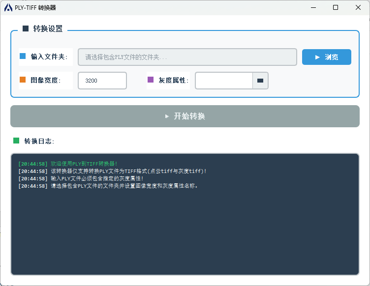

# ply转tiff

输入为ply文件，输出为xyz点云tiff图像和gray灰度tiff图像。
可以选择图像的width，以width决定height



## requirements


```
qt5
opencv
happly(header only)
```

## run

```
1. config 3th party lib in CMakelists.txt 
2. mkdir build && cd build
3. cmake ..
4. vs2019
```